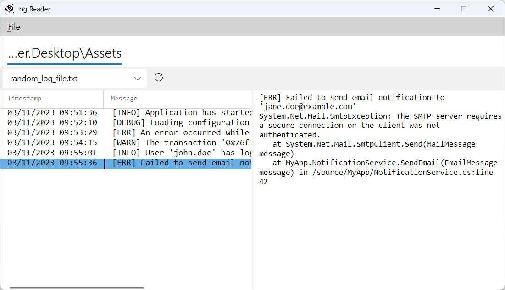

# Log Reader

A simple desktop application designed for reading and analyzing log files. Built with AvaloniaUI, it's cross-platform and efficient in handling large log files with ease.

## 🌟 Features

- **Split View**: Separates log entries and details into two panels for easy browsing.
- **Virtualization**: Efficiently handles large datasets with list virtualization.
- **Multiline Log Support**: Parses and displays multiline log entries.
- **Hardcoded Parsing Format**: Currently, the log parsing format is hardcoded but flexible for future customization.
- **Performance**: Optimized for fast reading and low memory consumption even with large log files.

## 🚀 Future Plans

- **Syntax Highlighting**: Enhances readability by visually distinguishing log components.
- **Multiple File Support**: Open, read, and analyze multiple log files simultaneously.
- **File Change Tracking**: Detects and displays real-time log file modifications.
- **Regex Support**: Custom parsing of log files.
- **Filtering Options**: Easily locate specific log entries or patterns.
- **Custom Parsers/Highlighters**: Allows users to add their own parsers to suit their log format.

## 🔧 Getting Started

### Prerequisites

- [.NET 7.0 Runtime](https://dotnet.microsoft.com/en-us/download/dotnet/7.0) installed
- Compatible with Windows, Linux, and macOS (mainly tested on Windows)

### Installation

[Download the latest release](https://github.com/Sumrix/LogReader/releases/latest) for your operating system and run the executable.

## 📖 Usage

This application is intended for anyone who needs to open and read log files. While developed with personal logs in mind, it can be adapted to different log formats as needed.

## 🤝 Contributing

Contributions are welcome! If you have a feature request, bug report, or wish to improve the application, please open an issue or submit a pull request.

## 📜 License

This project is licensed under the MIT License - see the [LICENSE](LICENSE.txt) file for details.

## 🛠️ Development Status

## 🖼️ Screenshots

_The application's UI showcasing the split view and multiline log support._
